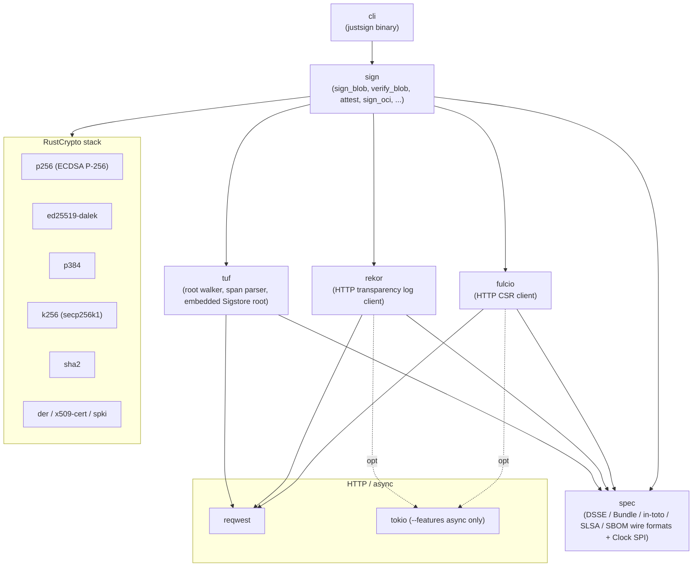
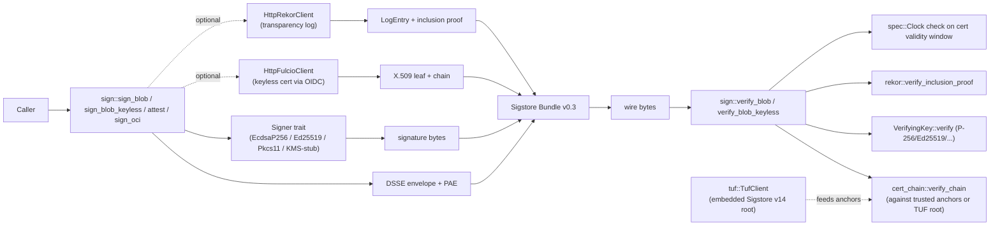
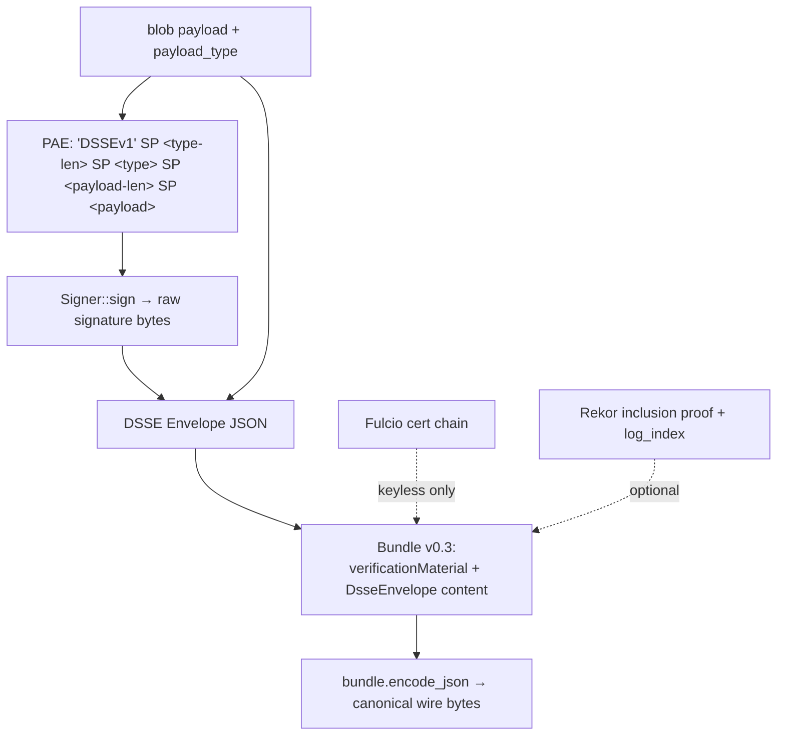
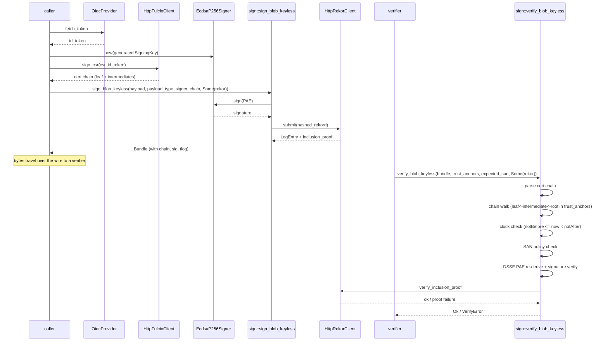

# Architecture

## Diagrams

Four diagrams covering the four shapes of the system: which crates depend on which (inclusion), how the pieces wire up at runtime (block), how a sign call flows data end-to-end (data flow), and how a keyless sign-then-verify call sequences (sequence).

### Inclusion: workspace dep graph



### Block: runtime layout of a sign + verify session



### Data flow: blob → DSSE → Bundle



### Sequence: keyless sign, then verify



## Six crates

| Crate | Role | Public surface |
|---|---|---|
| `spec` | Wire formats (DSSE, in-toto Statement, Sigstore Bundle, SLSA, SBOM) + Clock SPI | `Envelope`, `Bundle`, `Statement`, `Subject`, `Clock`, `SystemClock`, `FixedClock`, `pae`, predicate-type constants |
| `fulcio` | OIDC token + CSR → short-lived cert chain | `FulcioClient`, `HttpFulcioClient`, `MockFulcioClient`, `CertChain`, `build_csr` |
| `rekor` | Transparency log: submit + fetch + Merkle proof verify | `RekorClient`, `HttpRekorClient`, `MockRekorClient`, `LogEntry`, `verify_inclusion`, granular `RekorError` variants |
| `tuf` | TUF root walker, span-preserving JSON, embedded Sigstore production root | `TufClient::sigstore`, `TufClient::with_initial_root_bytes`, `verify_role` (Ed25519 + ECDSA P-256), `parse_with_signed_span`, `canonicalize` |
| `sign` | High-level API + per-algorithm signers + OIDC providers + KMS stubs + PKCS#11 + OCI signing + attestations | `sign_blob`, `verify_blob`, `sign_blob_keyless`, `verify_blob_keyless`, `attest`, `verify_attestation`, `sign_oci`, `verify_oci`, `Signer`, `VerifyingKey`, `OidcProvider`, `EcdsaP256Signer`, `Ed25519Signer`, `Pkcs11Signer` |
| `cli` | `justsign` operator binary | `generate-key-pair`, `public-key`, `sign-blob`, `verify-blob`, `oidc-token` subcommands |

## Key design decisions

**Pure Rust, std-only at the core.** No subprocess, no `cosign` binary, no FFI. RustCrypto for all primitives. `reqwest` (sync `blocking` by default; `tokio` only behind `--features async`).

**Bytes over Values for verification.** TUF role signatures verify against the *exact wire bytes* of the `signed` field (via `tuf::span::parse_with_signed_span`), not against a re-canonicalised emit. Closes the bytes-drift surface a re-canonicaliser bug class would otherwise leave open. See ADR `docs/3-design/adr/001_sigstore_tuf_bootstrap.md`.

**Algorithm-tagged VerifyingKey.** `verify_blob`'s `trusted_keys: &[VerifyingKey]` parameter dispatches across P-256 / Ed25519 / P-384 / secp256k1 at runtime. Each variant gates on its feature flag — default builds carry only P-256.

**Stub-then-promote for KMS.** AWS / GCP / Azure / Vault Transit signers ship as typed stubs (`SignerError::Stubbed` per call) so callers can declare the surface today. Real SDK integrations land per-provider as separate slices to keep the dep-tree balloon scoped. Tracked in #17–#20.

**Embedded Sigstore TUF root.** `TufClient::sigstore()` uses an `include_bytes!`-bundled v14 production root, validated by chained-root walking. Override available via `with_initial_root_bytes`. Build-time check fails the build if the bundled asset corrupts or expires; runtime guard returns `TufError::EmbeddedRootExpired` on stale bundle. ADR 001 documents the policy.

**Skip-pass for live integrations.** Every test that talks to a real network endpoint (Fulcio staging, Rekor staging, SoftHSM2, Sigstore TUF mirror) is *always-on* and prints `SKIP: ...` when its env var isn't set. CI reports test counts unchanged whether the live hosts are reachable or not.

## Pipeline (ASCII)

```
                       ┌───────────────────┐
                       │  Caller           │
                       │  (CLI / library)  │
                       └─────────┬─────────┘
                                 │
                                 ▼
                       ┌───────────────────┐
                       │  sign API         │
                       │  sign_blob /      │
                       │  verify_blob /    │
                       │  attest / sign_oci│
                       └─┬───┬───┬─────┬───┘
                         │   │   │     │
                         ▼   │   │     │
                       DSSE  │   │     │
                       PAE   │   │     │
                         │   │   │     │
                         ▼   ▼   ▼     ▼
                     Signer Fulcio Rekor TUF
                       │   │   │     │
                       └─┬─┴─┬─┴───┬─┘
                         │   │     │
                         ▼   ▼     ▼
                       ┌───────────────────┐
                       │  Sigstore Bundle  │
                       │  v0.3 wire bytes  │
                       └───────────────────┘
```

## Wire format authority

The Sigstore protobuf-specs v0.3 final is the wire-format source of truth. `Bundle::encode_json` emits the singular leaf shape `verificationMaterial.certificate.rawBytes` (protobuf `X509Certificate` oneof arm) — required by cosign 3.0+ — and accepts both that shape and the deprecated `verificationMaterial.x509CertificateChain.certificates[].rawBytes` chain wrapper on decode for cosign 2.x compat. Pinned by `test_encode_json_emits_canonical_certificate_shape` in `spec/src/sigstore_bundle.rs` (inverted in #38 from #31's pin). Verifiers reconstruct intermediates and the root from their TUF-validated trust anchors, not from the bundle.

For the threat model and what the verifier guarantees / does NOT guarantee, see [`docs/3-design/threat_model.md`](threat_model.md). For ADRs, see [`docs/3-design/adr/`](adr/).
